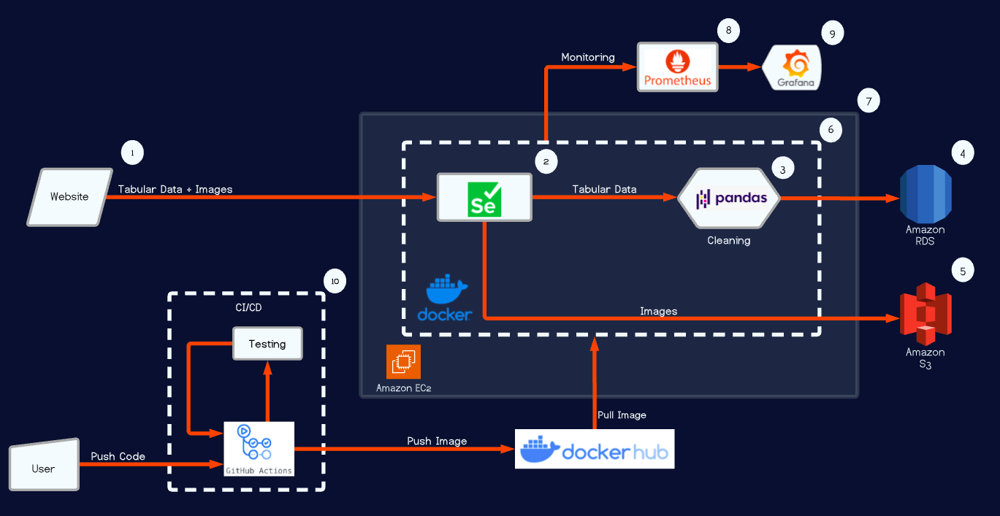
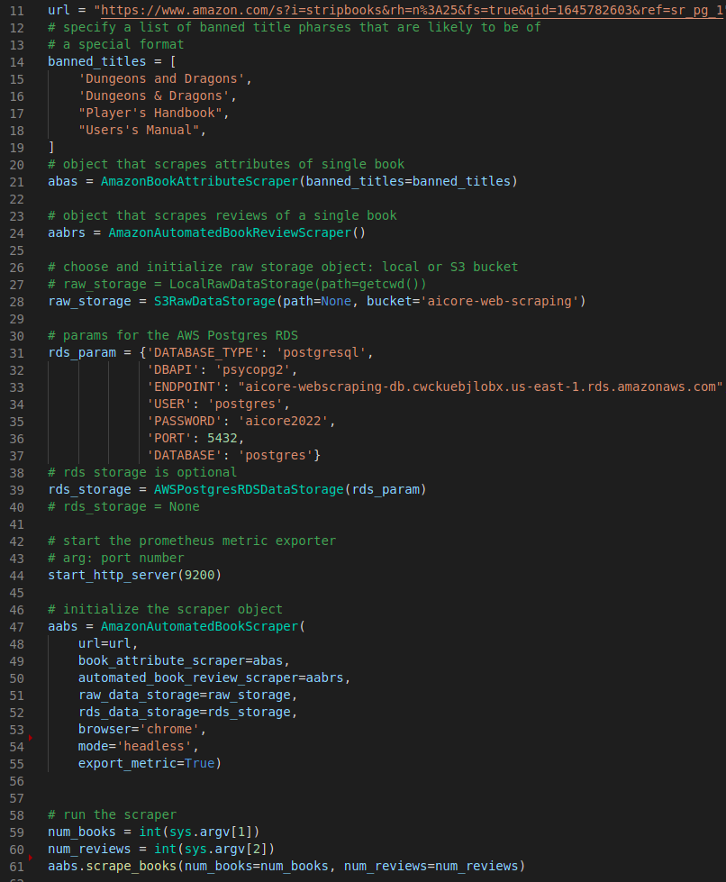

# Web-Scraping-Data-Pipeline (Amazon Books Scraping)
This web scraper scrapes book details from a specified Amazon book category. The scraped data is of two types: book attributes and book reviews. Each book has one set of attributes and a number of reviews. The data can be stored either in the local storage or in an AWS S3 bucket. Optionally, it can also be stored in an AWS Postgres relational database system (RDS).  

- Book attributes: tile, author, description, price, page number, bestseller rank, review rank, average review rating and cover page image
- Book review: review text, rating, and user name

## About the system

The system relies on Selenium (2) to automate web navigation and fetch data. The scraped data (attributes and reviews) is converted to json objects and saved either in local storage or AWS S3 bucket (5). The image data is stored separately. If the RDS option is selected, the data is also tabularized using Pandas (3) and stored in an AWS Postgres RDS system (4). 

The application is containerized using docker and runs on an AWS EC2 instance on the cloud. A prometheus (8) monitoring system is also deployed to monitor the health of the EC2 host, the docker and the containerized application. The monitored metrics are tracked by a Grafana (9) dashboard. 

The system also implements CI/CD with the help of Github actions. A push to the main branch of the repository will trigger a build of the docker image of the application. The image is then expected to be pulled at regular intervals during the scraping process.

## For the user
To run the application (outside of docker), execute the amazon_book_scraper/main.py script shown below. Line numbers will be referred to in brackets.

### Object-Oriented Design
The application follows object-oriented design (OOD) and the user should be aware of AmazonBookAttributeScraper class [21] that scrapes attributes of a single book, AmazonAutomatedBookReviewScraper class [24] that scrapes (with necessary navigation) reviews of a single book, LocalRawDataStorage [27] or S3RawDataStorage [28] classes (choose one) that represents a raw data storage object, AWSPostgresRDSDataStorage [39] class that represents an RDS storage object, and AmazonAutomatedBookScraper class [47] that brings together all objects and orchestrates them.

### Exporting application metric
The application exports a single metric "books_to_scrape" using the Prometheus Python client library. This is a gauge metric that represents the total number of books that remains to be scraped in the current execution of the application. The end-point that exports this metric is started as a http server (44). For this to function export_metric=True must be set (55).

### How to use the scrape_books method
The method scrape_books of AmazonAutomatedBookScraper is what actually does the scraping. It takes the number of books to scrape and the number reviews for each book as parameters. This method can be run as many times as required, either after a successful completion or a program crash, and it will resume operations based on stored data and new method parameters. If the required numbers of books and reviews are already satisfied, the application will simply return. Duplication of scraped data is avoided.

### Starting URL
The url (11) is where the Selenium web driver starts. This is expected to be the correct url for the right book category. In the case of Amazon books, the web page is expected to have a sort option to sort the list of books. 

### Cloud, containerization and monitoring
The application is intended to be run as a docker container in the cloud (AWS EC2 instance). The Dockerfile of the application calls the main.py script and passes default values for the two parameters of the scrape_books method. The docker image of the application is available at shbz1980/amazon_book_scraper:latest.

Steps to run the system:
- Run an instance of node_exporter in the host (https://github.com/prometheus/node_exporter). The node exporter publishes the host metrics.
    - docker run -d --rm -p 9090:9090 --name prometheus -v /home/ec2-user/prometheus:/etc/prometheus prom/prometheus --config.file=/etc/prometheus/prometheus.yml --web.enable-lifecycle
- Configure docker for publishing its metrics (https://docs.docker.com/config/daemon/prometheus/).
- Run the Prometheus server as a docker container. The config file, prometheus.yml, is included. Prometheus will be configured to monitor the host system, the docker system and the application. 
- Run the application container by exposing the necessary port (default: 9200) that exposes the application metrics.
    - docker run -it -p 9200:9200 shbz1980/amazon_book_scraper:latest 1000 20
    - The above command specifies 1000 books and 20 reviews each

## For the developer
The source code is designed such that it can be used for other book sites also.

- At the highest level, there are automated_book_scraper.py, book_attribute_scraper.py, book_review_scraper.py, entities.py, raw_data_storage.py, and rds_data_storage.py, all of which contains classes that are service provider independent and mostly of abstract type. The vast majority of the application functionalities are implemented here.
- Data storage: the developer inherits from abstract data storage classes to specific solutions:
    - both local and S3 data storage inherits from the abstract raw_data storage class.
    - aws_postgres data storage inherits from the abstract rds storage class
    - any new solution needs to inherit the relevant abstract classes
- Complete implementation: the developer inherits from the abstract service provider independent classes to implement service provider dependent classes. The included example is the amazon specific classes in amazon_automated_book_review_scraper.py, amazon_automated_book_scraper.py, amazon_book_attribute_scraper.py and amazon_book_review_scraper.py. These classes contain only amazon specific implementations.

## Future additions:
- Select sorting criterion of the list of books
- CI with automated testing. Only CD is implemented now.
